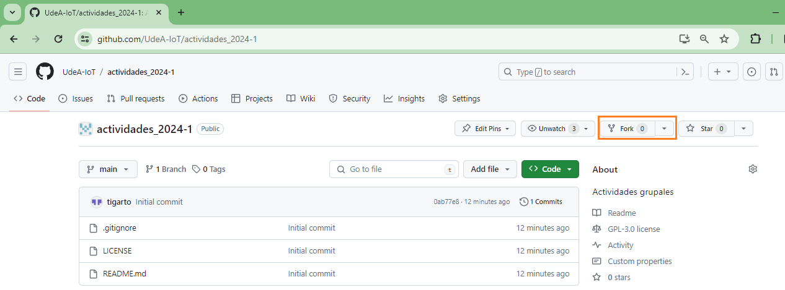

# actividades_2024-1

## Objetivos

> * Realizar el prototipado de aplicaciones sencillas usando los kits de sensores y la placa ESP32
> * Aprender a portar programas sencillos desde el Arduino a la ESP32.
> * Simular, en caso de ser posible, los prototipos usando herramientas como **Tinkercad** y **Wokwi**
> * Aprender a trabajar colaborativamente mediante el empleo de repositorios.

## Pasos previos

El proposito del siguiente repositorio es recopilar y documentar los aportes hechos por cada equipo en lo que respecta a las diferentes actividades del curso. La idea es que el trabajo sea lo mas colaborativo posible. Para tal fin se sugiere realizar lo siguiente:

1. Uno de los integrantes debe realizar un fork de este repositorio. 
   
   

   La persona del equipo que haya realizado el fork este será la única persona encargada de realizar el pull request al repositorio original para irlo actualizando conforme avance el curso. 

2. Una vez el encargado haya hecho el fork del repositorio, este se encargará de agregar a sus compañeros de equipo, como colaboradores en la rama del repositorio a la que acabo de hacer el fork.
   
3. Conforme avance el trabajo, cuando el encargado de manejar la rama considere que el trabajo de sus compañeros esta listo para ser integrado al repositorio base, el encargado hará un pull request para actualizar este repositorio.

## Actividades

- [ ] **Actividad 1** - Primeros pasos [[link](./actividad_1/)]