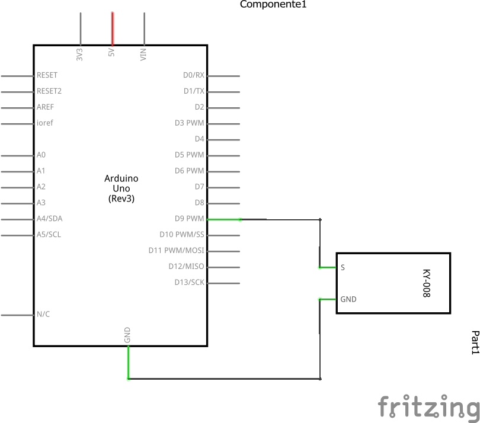
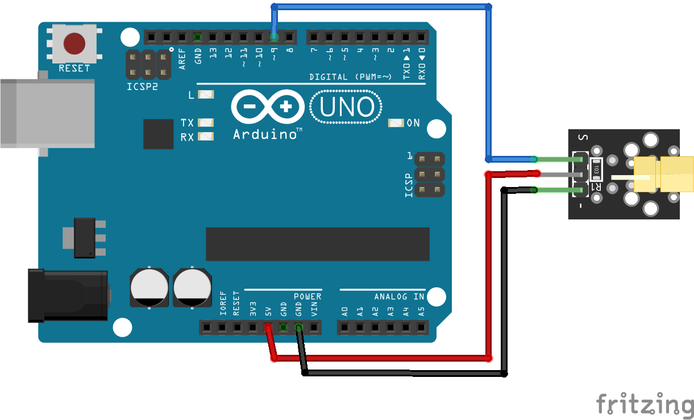

# Modulo de Laser

## Descripción

En este experimento, aprenderemos a utilizar el módulo láser.

## Hardware

### Lista de componentes

Lista de los componentes siguiendo llenando una tabla de la siguiente forma:

| Item # | Cantidad | Descripción   | Información |
| ------ | -------- | ------------- | ----------- |
| 1      | 1        | Elegoo Uno R3 | N/A         |
| 2      | 1        | USB cable     | N/A         |
| 3      | 1        | Laser module  | N/A         |
| 4      | 3        | F-M wires     | N/A         |

### Esquematico



### Conexiones



## Software

### Codigo

```
/*Define an integer variable pos and assign it to zero*/
int pos = 0;
/* void setup () The setup () function is called when the Arduino board is started. Use it to initialize variables, pin

patterns, get started with a library, and much more. This function runs only once for each Arduino board power-
up and reset.*/

void setup()
{
    /*Define module pins and set as output type*/
    pinMode(9, OUTPUT);
}

void loop()
{
    for (pos = 0; pos <= 255; pos += 1)
    {
        /*Read the value of the module variable */
        analog Write(9, pos);
        delay(25);
    }
    for (pos = 255; pos >= 0; pos -= 1)
    {
        analog Write(9, pos);
        delay(25);
    }
}
```

### Simulación

Enlaces con la simulación, de ser posible:

| Plataforma | Link                              |
| ---------- | --------------------------------- |
| Tinkercad  | No cuenta con componente de Laser |
| Wokwi      |                                   |
