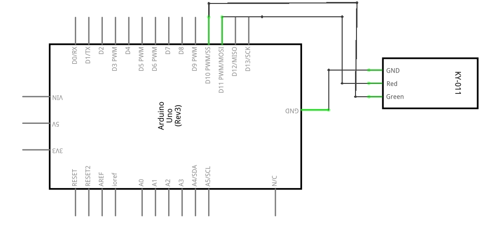
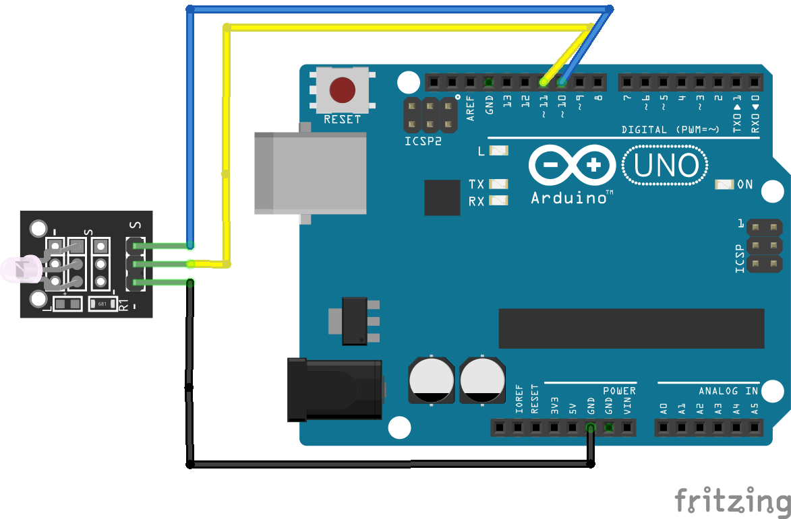

# Módulo LED de dos colores

## Descripción

El sistema crea un efecto de fading (atenuación) en los LED rojo y amarillo, cambiando gradualmente su brillo de máximo a mínimo y luego de mínimo a máximo de forma repetitiva, lo que produce un efecto visual interesante.

## Hardware
### Lista de componentes

Lista de los componentes siguiendo llenando una tabla de la siguiente forma:

|Item #|Cantidad|Descripción|Información|
|---|---|---|---|
| Elegoo Uno R3                 | 1 | Microporcesador     ||
| Dual-color Common-Cathode LED | 1 | LED de dos colores  ||
| F-M wires                     | 1 | Cables              ||

### Esquematico

Imagen con el esquematico del circuito


### Conexiones

Imagen con el diagrama de conexión


## Software

### Codigo

Código implementado en la placa empleada

```C++
// codigo de la placa base...
/* select the pin for the red LED */
int redpin = 11;
/* select the pin for the blue LED */
int yellowpin =10;
/*Define an integer variable val*/
int val;

void setup() {
  /*Defined redpin as the output type*/
  pinMode(redpin, OUTPUT);
  /*Yellowpin is defined as the output type*/
  pinMode(yellowpin, OUTPUT);
  /*Set the baud rate to 9600*/
  Serial.begin(9600);
}

void loop() {
  for (val = 255; val > 0; val--) {
    analogWrite(11, val);
    /*By val variable numerical changes to change the LED light color*/
    analogWrite(10, 255 - val);
    delay(15);
  }
  for (val = 0; val < 255; val++) {
    analogWrite(11, val);
    /*By vall variable numerical changes to change the LED light color*/
    analogWrite(10, 255 - val);
    delay(15);
  }
  Serial.println(val, DEC);
}
```

### Simulación

Enlaces con la simulación, de ser posible:

|Plataforma|Link|
|---|---|
|Tinkercad| [Link](https://www.tinkercad.com/things/e4FQ2cVtbkF-mighty-wluff-curcan/editel?sharecode=HzaXGHyJAvfLebxYiQh73-qeNV2-XmFENfs84hI3BmU) |
|Wokwi||


### Montaje real

Foto del montaje real realizado

