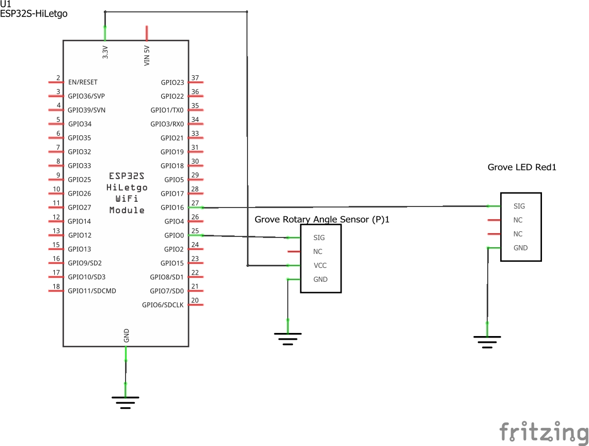

# Control de parpadeo

## Descripción

Descripción breve de lo que hace el sistema

## Hardware

### Lista de componentes

Lista de los componentes siguiendo llenando una tabla de la siguiente forma:

|Item #|Cantidad|Descripción|Información|
|---|---|---|---|
|1|1|Grove - Rotary Angle Sensor ([link](https://wiki.seeedstudio.com/Grove-Rotary_Angle_Sensor/))|Este modulo hace parte del Grove - Starter Kit v3 ([link](https://wiki.seeedstudio.com/Grove_Starter_Kit_v3/)|
|2|1|Grove - Red LED ([link](https://wiki.seeedstudio.com/Grove-Red_LED/))|Este modulo hace parte del Grove - Starter Kit v3 ([link](https://wiki.seeedstudio.com/Grove_Starter_Kit_v3/)|
|3|1|ESP32||

**Archivo fritzing asociado**: [ejemplo1_delay_ESP32.fzz](ejemplo1_delay_ESP32.fzz) 

### Esquematico

El esquematico del circuito se muestra a continuación:



### Conexiones

La conexión entre los componentes del modulo se muestra a continuación:


## Software

### Codigo

Código implementado en la placa empleada ([main.cpp](ESP32_control-parpadeo/src/main.cpp))

```C++
const int voltsInPin = 0; // GPIO0
const int ledPin = 16;    // GPIO16

void setup() {
  pinMode(ledPin, OUTPUT);
}
void loop() {
  int rawReading = analogRead(voltsInPin);
  int period = map(rawReading, 0, 1023, 100, 500);
  digitalWrite(ledPin, HIGH);
  delay(period);
  digitalWrite(ledPin, LOW);
  delay(period);
}
```

### Simulación

Enlaces con la simulación, de ser posible:

|Plataforma|Link|
|---|---|
|Tinkercad|---|
|Wokwi|[link](https://wokwi.com/projects/390853318294103041)|


### Montaje real

Foto del montaje real realizado


### Carpeta del proyecto

El proyecto se encuentra en el directorio [ESP32_control-parpadeo](ESP32_control-parpadeo/)

