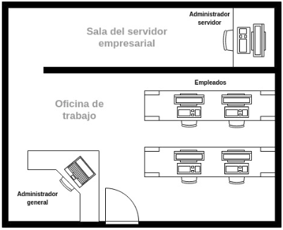
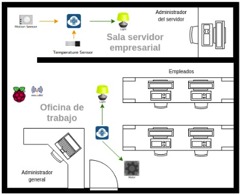

# Actividad 2

## Objetivos

> * Desarrollar “Cosas” inteligentes apoyado en las plataformas ESP8266 o ESP32.
> * Reforzar los conceptos teóricos básicos del protocolo MQTT planteando un diseño sencillo como solución a una situación problemática.
> * Hacer uso de internet como fuente de solución a problemas de programación encontrados durante el desarrollo de la práctica.

## Actividad

Homero Simpson se aburrió trabajando en la central nuclear de Sprinfield y decidió subirse en la fiebre del **.com** montando su propia empresa:

Despues de pensar un rato en el nombre, decidió bautizar su empresa como **CompumundoHiperMegaRed** y contrato a varios de sus amigos para trabajar. A Barney lo contrato para administrar el servidor y a Lenny, Carl, Moe y Skinner para que programen. 

Para las instalaciones de la empresa uso el garaje organizandolo de la siguiente manera:

Posteriormente, junto con sus empleados desplegó una arquitectura IoT para hacer mas agradable el espacio de trabajo:

La descripción y funcionalidad del hardware anteriormente instalado, se muestra a continuación:

|Elemento|Referencia|Función|
|----|----|----|
|Control|rPi|Control principal. Aquí se implementará una gui de control para manejará todos los componentes necesarios. Asi mismo aqui correrá el mosquitto|
|Nodo de la oficina|ESP32|Nodo que controlará la apertura de la puerta de la oficina y el encendido y apagado de la lámpara de la oficina.|
|Nodo de la sala del servidor|ESP32|Nodo que controlara el encendido y apagado de la luz de la sala del servidor. El encendido y apagado de esta solo depende del sensor de presencia y no del control principal, sin embargo, cuando se encienda o apague la lámpara se debe mandar una notificación del evento al control. Además este elemento estará conectado a un sensor que hará la lectura de la temperatura y la enviará al control (rPi).|
|lámpara 1|lámpara|Lámpara que ilumina la oficina y que es controlada desde la interfaz gráfica de la rPi.|
|lámpara 2|lámpara|Lámpara que ilumina la sala del servidor y que es controlada por el sensor de movimiento que se encuentra en esta.|
|Sensor de movimieto sala del servidor|sensor de movimiento|Sensor que detecta la presencia de alguien en la sala del servidor.|
|Sensor de temperatura de la sala del servidor|sensor de temperatura|Sensor de temperatura que mide la temperatura en la sala del servidor.|
|motor puerta|servomotor|Motor que permitirá abrir y cerrar la puerta.|

## Entregables

Se pide entregar las siguientes evidencias:
1. Directorio en el repositorio con las evidencias respectivas (archivos README.md, imagenes, esquemas, etc.). 
2.	Códigos (scripts de python, archivos ESP32, etc.)
3.	Video con evidencia.

## Plantilla 

ToDo...