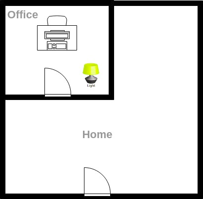
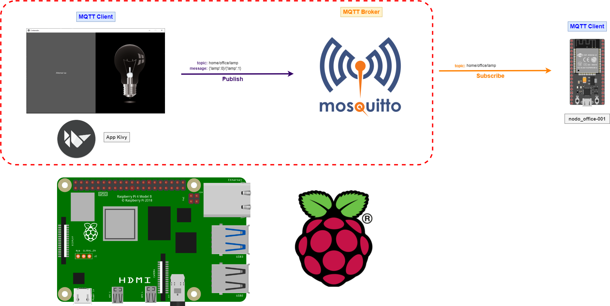
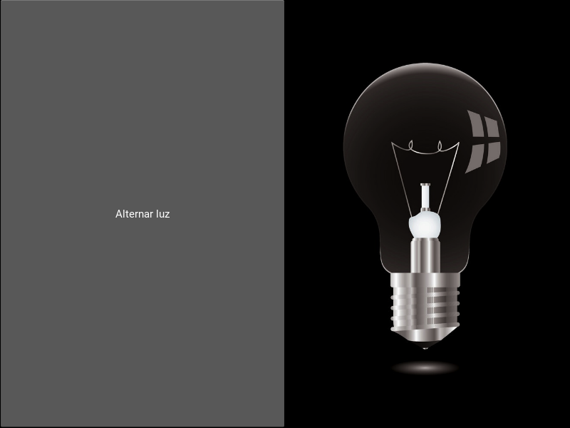
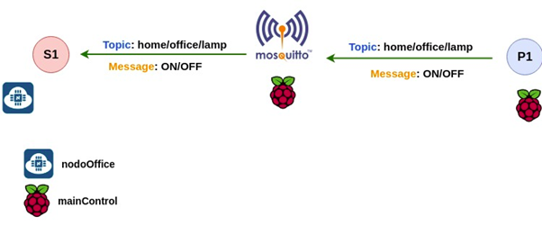
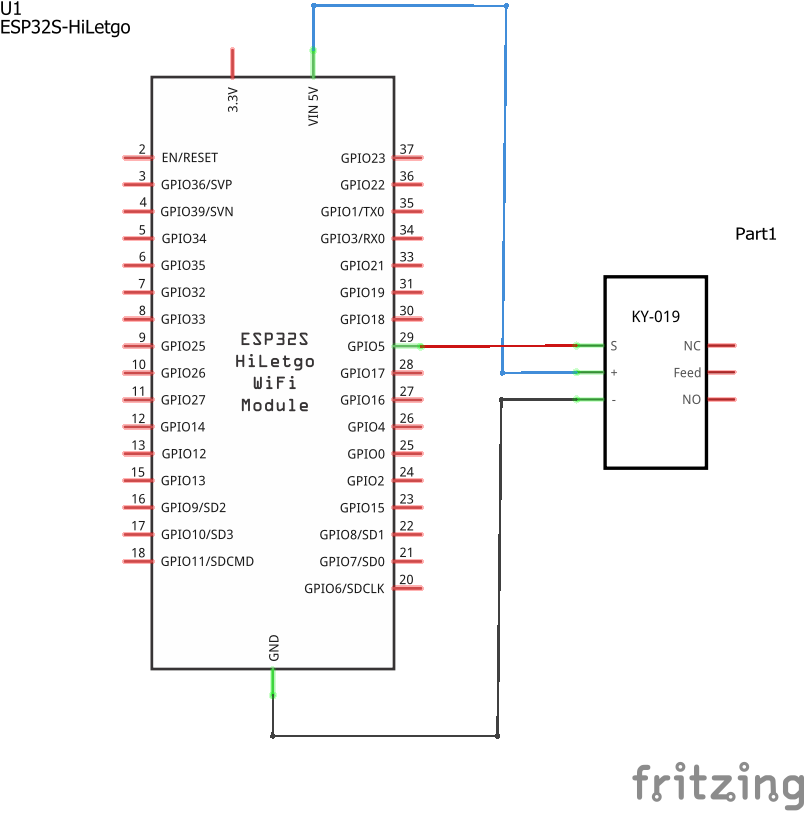
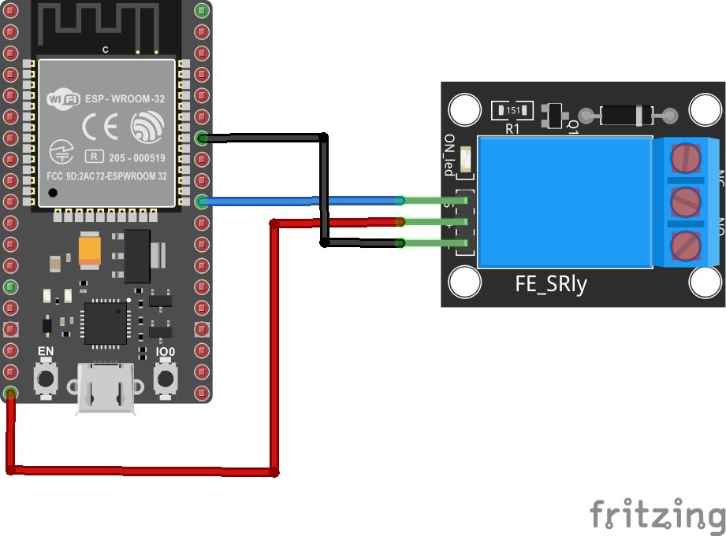
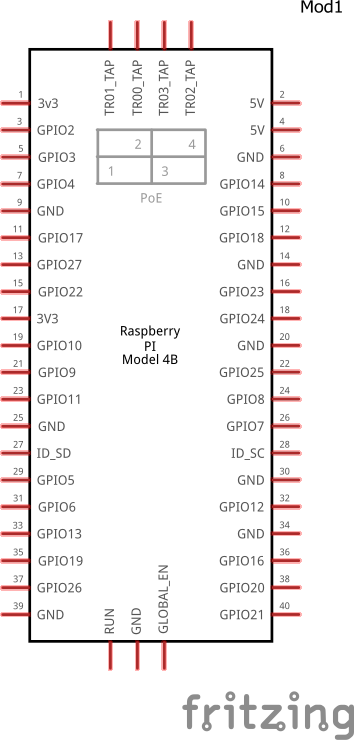
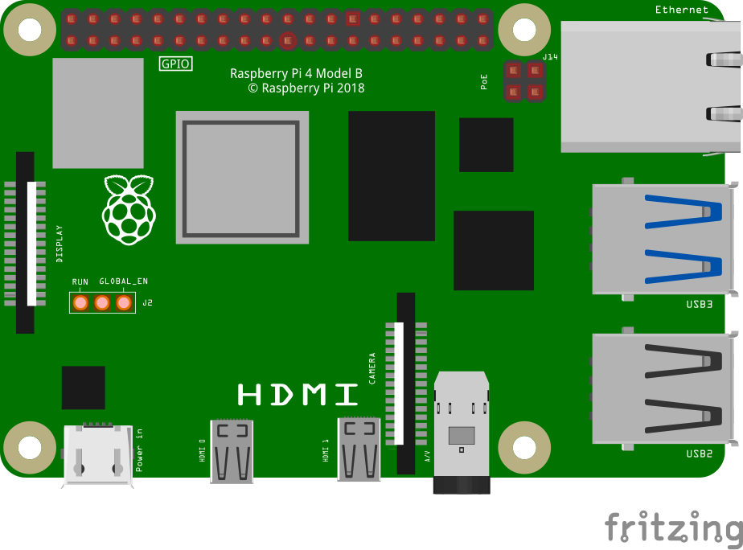
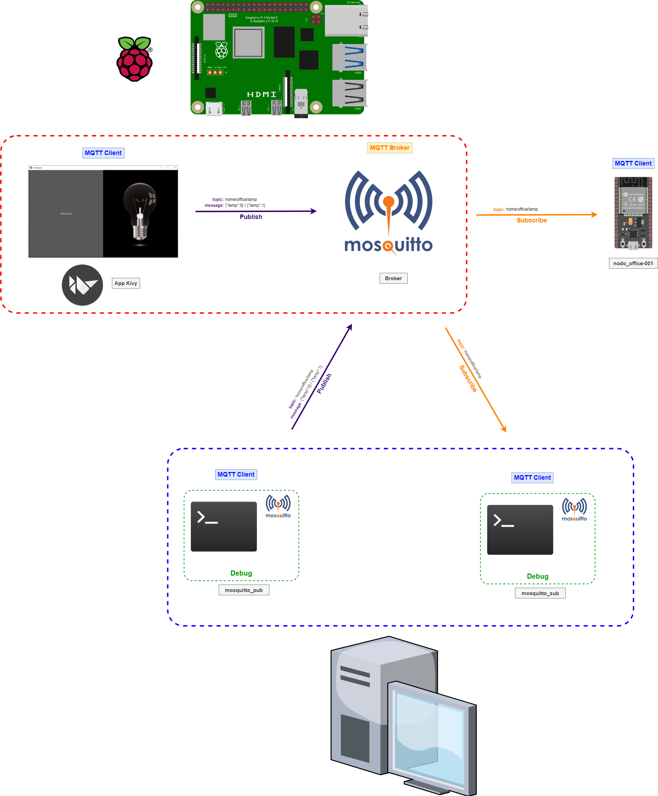

# Ejemplo 1

## Enunciado

Suponga que se tiene en la casa una oficina para trabajar tal y como se muestra a continuación:

<p align = "center">

</p>

Su objetivo será diseñar una aplicación que permita encender y apagar la luz de la oficina empleando el protocolo MQTT. 

## Solución

En la siguiente figura se muestra la solución a implementar:

<p align = "center">

</p>

La interfaz de control de la lampara implementada en la Raspberry Pi se muestra a continuación:

<p align = "center">

</p>

A continuación se describen los pasos para llevar a cabo la actividad:

1. **Selección de componentes**: Esto es libre para usted como diseñador, para el caso el encargado decidió emplear dos elementos principales:
   
   **Hardware**

   * **Thing 1 (nodo-office)**: Esta se encargará de controlar el encendido y apagado de la lampara de la oficina. Para el caso vamos a rotular este dispositivo como **nodo-office**. A continuación se describe el hardware que la compone:

      |Item|Elemento|Descripción|
      |---|---|---|
      |1|ESP32|Microcontrolador que funciona como cliente MQTT para controlar el encendido y apagado de la lampara|
      |2|Rele|Rele para el encendido y apagado de la lampara|
      |3|Placa con bombillo|Bombillo de la lampara|

   * **Dispositivo de borde (main-control)**: Para este caso se usará una placa Rpi donde se encontrará el broker mosquitto y la interfaz gráfica de control. Para el caso vamos a referirnos a esta como **main-control**:
  
      |Item|Elemento|Descripción|
      |---|---|---|
      |1|Raspberri Pi|Single board computer donde se ejecutará el broker y la interfal principal de control de la aplicación|


2. **Definir los roles de los clientes MQTT así como los dispositivos a los que estos van a estar asociados**: Definir los `topics`, asi como el rol de los clientes(`publisher` y `suscriber`) asociados a estos. Para el caso la siguiente gráfica muestra esto:
   
   <p align = "center">
   
    </p>

   De la figura anterior se puede notar que el broker y un cliente que publica al topico (`home/office/lamp`) corren en la Raspberri Pi y un cliente suscrito (al topico `home/office/lamp`) el ESP32: La siguiente tabla describe el diagrama anterior esto:

   |Cliente|Tipo|Topic|Messages|Dispositivo |
   |---|---|---|---|---|
   |`P1`|Publisher|`home/office/lamp`|	`{"lamp": 0}`/`{"lamp": 1}`|`main-control`|
   |`S1`|Subscriber|`home/office/lamp`||`nodo-office`|

3. **Implementar el hardware**: Tener claramente definidas las conexiones de hardware para cada componente de la red mqtt. A continuación se espefifica el caso para cada cosa:
   
   *  **Thing 1 (nodo-office)**: 
   
      * **Esquematico**:
         
        <p align = "center">
        
        </p>

      * **Conexiones**:
        
        <p align = "center">
        
        </p>


    *  **Dispositivo de borde (main-control)**: 
   
       * **Esquematico**:
         
         <p align = "center">
         
         </p>

       * **Conexiones**:
        
         <p align = "center">
         
         </p>

4. **Implementar el software**: Se procede a codificar las aplicaciones de acuerdo a los requerimientos del problema:

   * **Codigo ESP32**: Asumiendo que se empleo la tarjega `Nodenodemcu-32s` los archivos asociados se encuentran en el directorio **ESP32_nodo-office** ([link](ESP32_nodo-office/)). A continuación se listan cada uno de los archivos asociados:
      * [platformio.ini](ESP32_nodo-office/platformio.ini)
      * [config.h](ESP32_nodo-office/src/config.h)
      * [main.cpp](ESP32_nodo-office/src/main.cpp)   
   
   La implementación de la parte de MQTT en el ESP32 se resume en la siguiente tabla: 

   |#|Topico|Mensaje|Descripción|Rol (S/P)|
   |---|---|---|---|---|
   |1|```home/office/lamp```|Topico que recibe el comando enviado desde la interfaz de control||```S```|

   * **Codigo Raspberri Pi**: En este se implementa la interfaz grafica de controla el encendido y apagado de la lampara. En el directorio **RPi_main-control** ([link](RPi_main-control/)) se encuentra el codigo correspondiente con la aplicación. A continuación se listan cada uno de los archivos de la aplicación de control:
      *  [contenedor.kv](RPi_main-control/contenedor.kv)
      *  [contenedor.py](RPi_main-control/contenedor.py)
      *  [iot.py](RPi_main-control/iot.py)
      *  [comm.py](RPi_main-control/comm.py)
    
     La implementación de la parte de MQTT en la interfaz grafica que se ejecuta en la RPi se resume en la siguiente tabla: 

     |#|Topico|Mensaje|Descripción|Rol (S/P)|
     |---|---|---|---|---|
     |1|```home/office/lamp```|```cmd```|```cmd``` corresponde al comando enviado para encender (```{"lamp": 1}```) o apagar el led ```{"lamp": 0}```.|```P```|


5. **Verificar el correcto funcionamiento de cada componente de la red**: Para ello se realizan las diferenter pruebas de conectividad de los componentes empleando los clientes `mosquitto_pub` y `mosquitto_pub` linea de comandos. Para realizar el debug, se implementará la siguiente topologia:
   
   <p align = "center">
   
   </p>

## Referencias
   
* https://www.upesy.com/blogs/tutorials/esp32-relay-module-using-arduino-code
* https://juantrucupei.wordpress.com/2022/10/06/conectar-rele-relay-5v-en-microcontrolador-esp32-con-micropython/
* https://devices.esphome.io/devices/ESP32-Relay-X2
* https://www.makerguides.com/es/interfacing-a-relay-module-with-esp32/
