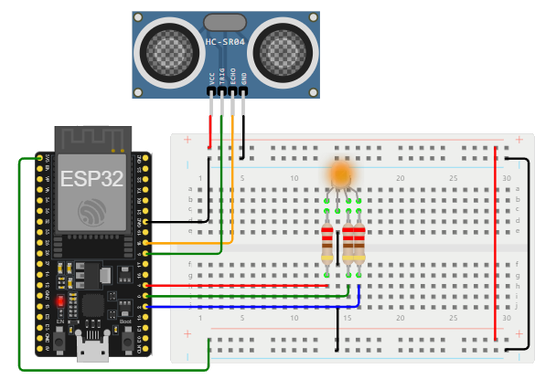

# ESP32 thing1

## Resumen

ToDo...

## Componentes

ToDo...

## Hardware

## Software

El condigo se encuentra en el directorio [code](code/) y se encuentra organizado de la siguiente manera:
* [plarformio.ini](code/platformio.inipla)
* [include](code/include/)
  * [io.h](code/include/io.h)
  * [connections.h](code/include/connections.h)
  * [mqtt_config.h](code/include/mqtt_config.h)
* [src](code/src/)
  * [io.cpp](code/src/io.cpp)
  * [connections.cpp](code/src/connections.cpp)
  * [main.cpp](code/src/main.cpp)

## Simulaciones

### Caso sin MQTT

ESP32-no_mqtt-example1-thing1_2024-1 [[link]](https://wokwi.com/projects/395291436304944129)

### Caso con MQTT

ESP32-mqtt-example1-thing2_2024-1 [[link]](https://wokwi.com/projects/395294148400982017)

* **Simulación en Wokwi**:
  
  

  
  

* **Cliente que suscribe (MQTT explorer)**:

  

  
  

* **Cliente que suscribe (mosquitto_sub)**:
  
  

  
  

## Test real

Aunque envia, los resultado arrojados por el sensor de ultrasonido estan dando raros (posible error).

* **Salida serial del ESP32**:

  

  
  

* **Cliente que suscribe (MQTT explorer)**:

  

  
  

* **Cliente que suscribe (mosquitto_sub)**:
  
  

  
  
